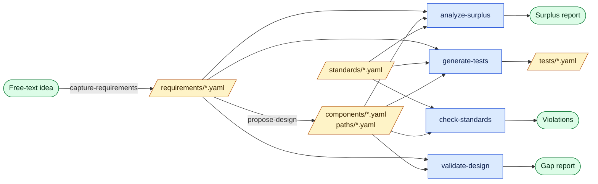

# ComponentActionGraph

A typed graph of **Power BI / M365 components** and the **user action paths**
that traverse them — structured so GitHub Copilot (or any agent given the
repo) can:

1. **Propose a design** from a set of requirements.
2. **Validate a design** against requirements.
3. Enforce **component standards** (naming, security, governance, lineage).
4. **Generate test cases** that exercise standards × requirements × paths.

The action catalog for each component type is **grounded in Microsoft Learn**
via the official [Microsoft Learn MCP server][mcp], so the vocabulary stays
aligned with the real product.

[mcp]: https://github.com/MicrosoftDocs/mcp

## Workflow at a glance

Each box below is a reusable prompt in `.github/prompts/`. They chain
together to take an idea from free text all the way to a tested,
standards-checked component graph.



| Prompt | Input | Output |
|---|---|---|
| `capture-requirements` | Free text | `requirements/*.yaml` |
| `propose-design` | Requirements | `components/*.yaml`, `paths/*.yaml` |
| `validate-design` | Requirements + graph | Gap report (markdown) |
| `check-standards` | Standards + graph | Violations (markdown) |
| `generate-tests` | Requirements + standards + paths | `tests/*.yaml` |
| `analyze-surplus` | Requirements + graph + standards | Surplus-capability report (markdown) |

## Repo layout

```
.github/
  copilot-instructions.md     # primary agent brief
  prompts/                    # six reusable playbooks
.mcp.json                     # wires Microsoft Learn MCP
ontology/
  component-types/            # one YAML per type (Report, SemanticModel, …)
                              # each carrying its OWN action catalog
  edge-types.yaml
  permissions.yaml
  personas.yaml
  sources.yaml                # canonical MS Learn URLs per type
  index.md
schemas/                      # JSON Schema (draft 2020-12) for every file kind
components/ paths/ standards/ requirements/ tests/
                              # v1 is authored; v2 can be populated by importers
examples/                     # end-to-end reference graph
tools/cag/                    # the CLI
```

## The core idea

> **The set of actions a user can perform is a property of the component type.**

Every file in `ontology/component-types/` looks like:

```yaml
id: Report
sources:
  - https://learn.microsoft.com/power-bi/collaborate-share/collaborate-share-overview
  - https://learn.microsoft.com/power-bi/collaborate-share/service-share-reports
allowedEdges: [reads-from, surfaced-in, contained-by, labeled, depends-on]
actions:
  - id: view                    ; requires: [permission:read]
  - id: share                   ; requires: [permission:reshare, license:pro-or-ppu]
  - id: export-to-pdf           ; requires: [permission:read, tenant-setting:export-reports]
  - id: endorse-promoted        ; requires: [role:workspace-contributor-or-above]
  - id: certify                 ; requires: [role:certifier]
  - ...
```

A **path** is a persona walking through components using actions from those
catalogs:

```yaml
id: path-exec-monthly-sales-review
persona: persona:executive
steps:
  - { component: app:finance-app,        action: open }
  - { component: report:fin-sales-report, action: view }
  - { component: report:fin-sales-report, action: export-to-pdf }
```

The CLI rejects any step that uses an action not in the target type's
catalog. That's what makes the graph trustworthy for design, validation, and
test generation.

## Using it with Copilot / Claude Code

1. `.github/copilot-instructions.md` is the primary agent brief.
2. `.github/prompts/*.prompt.md` contains four reusable playbooks:
   `propose-design`, `validate-design`, `check-standards`, `generate-tests`.
3. `.mcp.json` wires the Microsoft Learn MCP server so the agent can ground
   new action catalogs in the real docs.

Claude Code users can also install the official plugin:

```bash
/plugin install microsoft-docs@claude-plugins-official
```

## CLI

```bash
# one-time build
(cd tools/cag && npm install && npm run build)

# from the repo root — the CLI scans every YAML under the repo
# (ontology/ and schemas/ are loaded separately)
node tools/cag/dist/cli.js validate
node tools/cag/dist/cli.js check-standards
node tools/cag/dist/cli.js coverage
node tools/cag/dist/cli.js graph --format mermaid
node tools/cag/dist/cli.js graph --format mermaid --out graph.mmd

# Drift check — fetches MS Learn pages via the MCP server and warns when
# the live docs mention an action the ontology hasn't captured.
node tools/cag/dist/cli.js check-standards --refresh-sources

# Use --root <dir> to validate a different copy of the repo (e.g. a sandbox).
```

Scaffolding new files:

```bash
node tools/cag/dist/cli.js new component    > components/reports/my-report.yaml
node tools/cag/dist/cli.js new path         > paths/my-journey.yaml
node tools/cag/dist/cli.js new standard     > standards/my-standard.yaml
node tools/cag/dist/cli.js new requirement  > requirements/my-req.yaml
node tools/cag/dist/cli.js new test         > tests/my-test.yaml
```

## What the example graph demonstrates

`examples/` contains a small but complete graph:

- 1 workspace, 1 app, 1 semantic model, 1 report, 1 sensitivity label, 2 identities
- 1 persona (`executive`) + 1 path (monthly sales review with a PDF export)
- 3 standards (prod-must-have-owner, report-naming, confidential-no-publish-to-web)
- 3 requirements (sales monthly view, export must be labeled, dedicated prod workspace)
- 3 tests covering every requirement

Run `node tools/cag/dist/cli.js validate` from the repo root to see it all
resolve cleanly.

## Adding new requirements

Requirements capture what the graph **must** or **should** do, independent of
how it is implemented. They are the source of truth for test coverage.

### 1 — Write a requirement file

Create a YAML file in `requirements/` (or `examples/requirements/` for the
reference graph). The id must follow the pattern `req-<slug>`:

```yaml
id: req-row-level-security
kind: requirement
title: Finance reports enforce row-level security for regional managers
description: >
  A regional manager may only see rows for their own region. The semantic
  model must apply an RLS role that filters by the user's AAD group
  membership.
stakeholder: chief-data-officer   # free-text; matches ontology/personas.yaml
priority: must                    # must | should | could | wont
satisfiedBy:
  - semantic-model:fin-sales-model   # typed refs — component or path ids
  - path-exec-monthly-sales-review
verifiedBy:
  - test-rls-regional-manager        # filled in once the test exists
```

**Fields at a glance**

| Field | Required | Notes |
|---|---|---|
| `id` | yes | `req-` prefix, lowercase, hyphens |
| `kind` | yes | always `requirement` |
| `title` | yes | one-line summary |
| `description` | no | plain-language elaboration |
| `stakeholder` | no | who owns this need |
| `priority` | yes | MoSCoW — `must` / `should` / `could` / `wont` |
| `satisfiedBy` | no | components or paths that deliver the requirement |
| `verifiedBy` | no | test ids that prove it |

### 2 — Let the agent propose a design

Open `.github/prompts/propose-design.prompt.md` in Copilot Chat or Claude
Code and paste your requirement file. The agent will suggest which components
and edges to add or modify.

### 3 — Validate the updated design

```bash
node tools/cag/dist/cli.js validate
```

Fix any schema or referential integrity errors before moving on.

### 4 — Generate tests for coverage

```bash
node tools/cag/dist/cli.js coverage
```

Use `.github/prompts/generate-tests.prompt.md` to turn uncovered requirements
into concrete test files, then fill in the `verifiedBy` list on the
requirement.

### 5 — Add or tighten standards (optional)

If the requirement implies a rule that must hold across *all* components of a
type (not just this one), encode it as a standard in `standards/` — see
[Adding standards](#adding-new-standards) below.

---

## Adding new standards

Standards are declarative rules applied to **all** components that match a
selector. They live in `standards/` (or `examples/standards/` for the
reference graph). The CLI evaluates them on every `check-standards` run and
the test generator can auto-produce negative tests for `forbidsAction` rules.

### Where standards live

```
standards/                  # your project's standards (gitignored template)
examples/standards/         # reference graph — three working examples:
  std-confidential-no-publish-to-web.yaml   # forbidsAction on labeled reports
  std-prod-must-have-owner.yaml             # requires fields on prod assets
  std-report-naming.yaml                    # regex pattern on report names
schemas/standard.schema.json               # authoritative field definitions
```

### Writing a standard

```yaml
id: std-rls-required-on-prod-models          # std- prefix, lowercase, hyphens
kind: standard
title: Production semantic models must enforce row-level security
rationale: >
  Without RLS, any user with a read permission on the workspace can see all
  rows — incompatible with regional data residency requirements.
severity: error                              # error | warn | info
appliesTo:
  type: [SemanticModel]                      # one or more component-type ids
  where:
    environment: prod                        # filter on any component field
rule:
  requires: [rls]                            # component must have this field set
```

**Rule variants**

| Rule key | What it checks |
|---|---|
| `requires` | component must have these fields present and non-empty |
| `forbids` | component must NOT have these fields set |
| `pattern` | field values must match the given regex (e.g. naming conventions) |
| `edgeRequired` | component must have at least one edge of this type |
| `edgeForbidden` | component must not have any edge of this type |
| `forbidsAction` | action must not appear in any path step targeting this component |
| `requiresAction` | action must appear in at least one path step targeting this component |

### Checking standards

```bash
node tools/cag/dist/cli.js check-standards
# add --refresh-sources to diff your catalog against the live MS Learn docs
```

---

## Extending the ontology

1. Add or modify a file under `ontology/component-types/` — PR-reviewed.
2. Every new or changed action must be backed by an MS Learn URL in
   `sources:`.
3. Run `cag check-standards --refresh-sources` to have the Microsoft Learn
   MCP diff your catalog against the live docs.

## Out of scope (for now)

- Importers that populate the graph from live tenants (Power BI REST,
  Microsoft Graph, Purview). The schema is importer-ready; tooling can
  come later.
- Policy-as-code (OPA / Rego). The declarative rule grammar covers v1.
- A web UI. Mermaid + the CLI cover v1.
